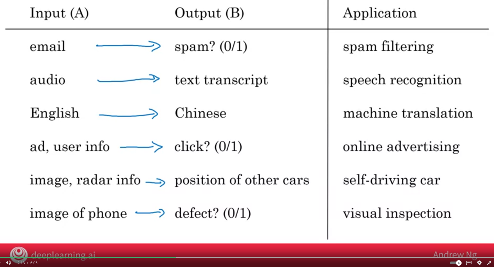

<h1 align="center">What is AI</h1>

### Demystifying AI

### AI

- ANI (Artificial Narrow Intelligence) => E.g self driving cars, smart speakers, AI in farming & factories, web search (Some very good progress is being made in this direction)
- AGI (Aritifical General Intelligence) => Do anything that a human can do or even more things that humans can do. (Still requires a lot of research and decads)

### Machine Learning

#### Why now ?
The main reason is neural network also called deep learning and special hardwares like GPUs. Also dont forget a large data set is also required as well.  

#### Supervised Learning
A       ->  B
Input   ->  Output

If an input is Email and output is spam or not.

#### What is data
Data is important to build AI system, but what is data ?

The input and output can depend on your business like If you want to find out what will be an esitmated price of a house of X size and Y bedroom or you can say I have X budget and a house of how much size and bedrooms I can get. 

In the cat dataset an application is build to find out a given picture is of a cat or not. So the Input is image and output is either a cat or not. 

#### Acquiring data

- Manual Labeling
    A trial and tested way of to build a data set in which lables are assigned.
- From Observing behaviours
    Collecting dataset form users or machines. You can observe the behaviour of users of a web app like on which price users buys or a data set collected from machine that shows at what temperature machines are at fault.
- Download from website/paternship
    Now we have a dataset of images, self-driving, speach recognition etc. Or your partner/company you're working for might have dataset.

#### Use and mis-use of data

Its a misconception that for an IT team that they will first collect years of data and then will give them to their AI department. The better approach is to start giving data to AI team so that they can give feedback like if you collect that after every minute rather than 2 minutes we'll better able to train the system.

This doesn't always work out that an AI team can consume a data of terra bytes and produce valueable output. 

Overinvesting in IT infrastructure to collect data in hope of it'll be useful for AI but in reality it may be not.  

#### Data is messy

- If you have bad data AI will learn in bad way
- Data problems
    - Incorrect lables
    - Missing vlaues
- Multiple type of data
    - un-structured data => images, audio, test
    - structured data => that lines well in data sheets
    

#### Machine learning vs data science
- Machine learning as an AI system that given and Input A gives an output B.

- Datascience output is set of insights to help made business decisions. Like a renovated home have a 15% premium.

- Datascience may use some of the AI tools but it also has its own tools of set. [Reference](#ai-tools)

### Deep Learning

Takes an Input A process using Aritifical Neural Network and output B. 

Neural networks were orginally inspired by the brin byt the details how they work are almost completely unrelated to how biological brain work.

A neural network consists of thousands of neurons

### AI has many tools 
- Machine Learning and Data Science
- Depp learning / Neural Network
- Other buzzwords: Unsupervised, reinforcement learning, graphical models etc...

### What makes an AI company

Like if you have a shopping mall and a website it doesn't means an internet company. Similary any company have a use of few neural networks can't say an AI company. 

#### AI Transformation

Systematic porcess to become effective at using AI

1. Execute pilot projects to gain momentun
    Do a few small projects to get sense of what AI can and can't do and what it feels to do an AI project.

2. Build an in-house AI team
3. Provide broad AI training
    Both engineer and managers
4. Develop and AI strategy
5. Develop internal and external communications
    All stakholders (employees, investors, customers,) are aligned with how company navigating the rise of ai

### What machine learning can and can't do
We only see sucess stories on media and no failure stories so people thinks AI can do every thing.

##### Self-drivin cars

With a 10,000 data set of cars its easy to identify another car, but with 10,000 data set of hand gesters its very hard to findout what is the context and purpose of raising hand.

##### X-ray diagnosis
AI can diagonse pneumonia with 10,000 labled images of real people chest X-ray. But it can't diagnose pneumonia from 10 images of a medical text book, where as a young doctor reading the medical book can diagnose it. 

If you train a data on high defination data like X-ray taken from high tech hospital and apply the same system in which X-rays are not good the system will not behave correctly where as a human can diagnose it.

### What makes a ML problem easier
1. Learning a "simple" concept
    - simple means it requres less than 1 sec of mental power to come conclusion. E.g looking outside a window of a self drving car spot another car is simple. whereas to write an emptathic response is complex. 

2. Lots of data available
    - If we have A and B for a large data set. Like A is a large set of email and B is labeling what type of email like refund request or shipping query or other problem.