<h1 align="center">Building AI Projects</h1>

### Starting an AI Project
- Workflow of projects
    - sequence of project
- Selecting AI projects
- Organzing data and team for the project

### Workfow of a machine earning project

Machine Learning algorithms can learn Input to Output mappings.

#### Key steps of machine learning projects

#####  Example: Alexa speech recongition

1. Collect data
    - When we say Hey Alexa! how to recongnize? so first step in collect data in which you'll ask people (male, female, child) to say Alexa and other words as well.
2. Train model
    - use machine learning algorithms to create A to B mappings. Like in this case A is an audio clip saying Alexa
    - iterate many time until good enough
3. Deploy model
    - Deploy your model in acutal applicatoin and see it working. Like if you trained your model on US accent and your peoduct is used by a UK accent guy, it might not recoginze the speach well. So,
    - Get data back
    - Maintain/update model

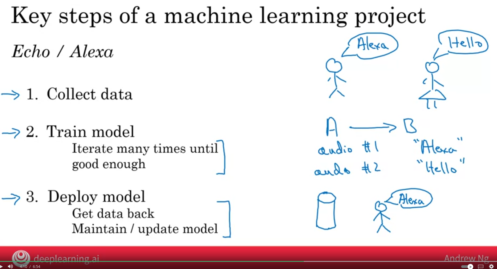

#####  Example: self drving car

let apply the above.

1. Collect data => in this we will collect pictures of cars
2. Train Model => apply machine learning algorithm, The input A is cars data and the output is to find where the other cards are.
3. Deploy Model => Now test your model and you might see there is a car let see Tesla truck that your model doesn't recognise so get data and update the model

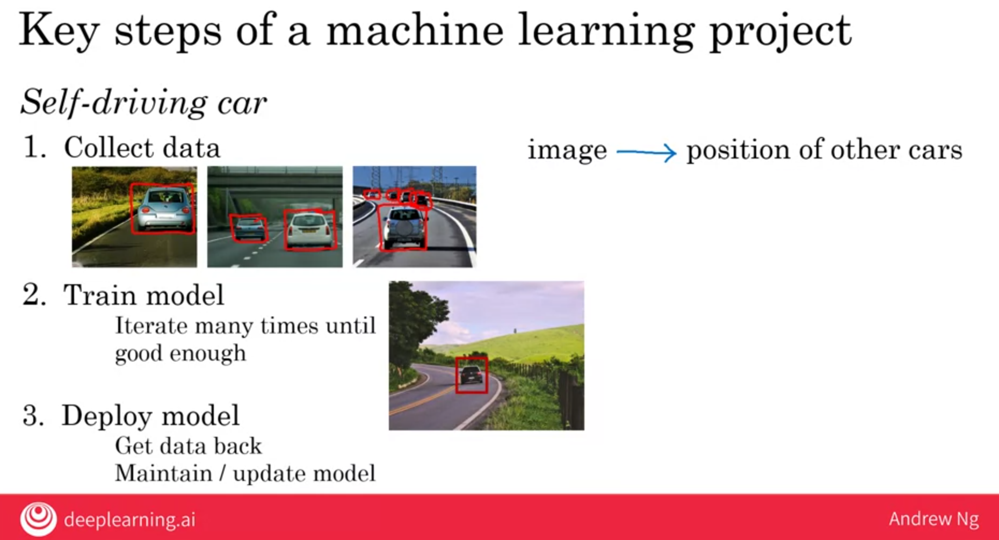

### Workfow of a data science project

The output of data science is often set of actionable insights.

1. Collect data
2. Analyze data
    - iterates many times to get good insights
3. Suggest hypotheses/actions
    - Depoly changes
    - Re-analyze new data periodically

#####  Example: Optimizing sales funnel

The flow of sales is:
- Customer visit webpage
- Select product 
- Go to product page
- Add to shopping cart
- Checkout page

1. Collect data => Collect as much data about users like which country users are going to which page. 

2. Anaylze data => overseas customers are scared of shipping cost a lot of people go to checkout but didn't proceed. Or on holidays more people buy. or o holidays less people buy

3. Sugguest hyphotheses/actions => Incorporate shipping cost in product or spend less on ads on holidays. Apply the actions and get data back and re-apply preodically. 

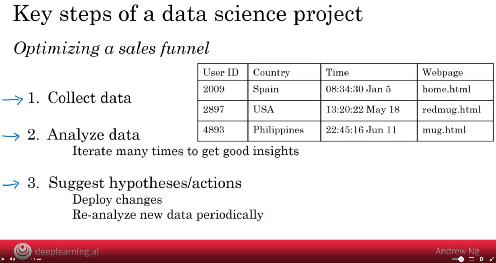

### Every job funcation meeds to learn how to use data

Data is transforming many job functions, with the digitation of data there is a high chance your job function can be helped with the tool of Data science and Machine learning

- Sales
    - Automated lead sorting => prioritze a large company to call rather than medium or low
- Manufacturing line manager
    - Automated visul inspection => to inspect a borken or damaged piece. 
Recuiters
    - resume screening
- Marketing
    - Customized recommendation to customers
- Agriculture
    - Precisoin Weed killer

### How to choose an AI project
Framwork to brainstrom potentional projects you can do. 

- AI experts => can helps what is or what isn't AI can do
- Domain experts => can helps what is valueable for the business

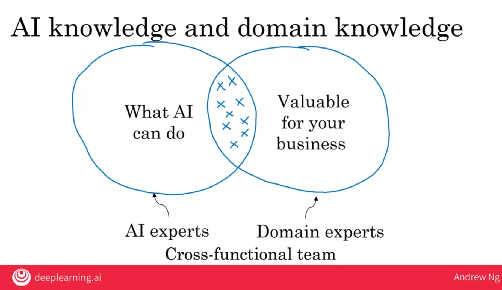

#### Brainstorming framework
Think about automating **task** rather thena automating jobs. 

### Common questions asked to CEOs by Andrew while brainstorming AI projects for them

1. What are the main drivers of business vaules ?
2. What are the main pain points in your business ?

Don't give up by thinking you have small data set to start working. If you want to idenitfy damage mug, small set of data can also work.

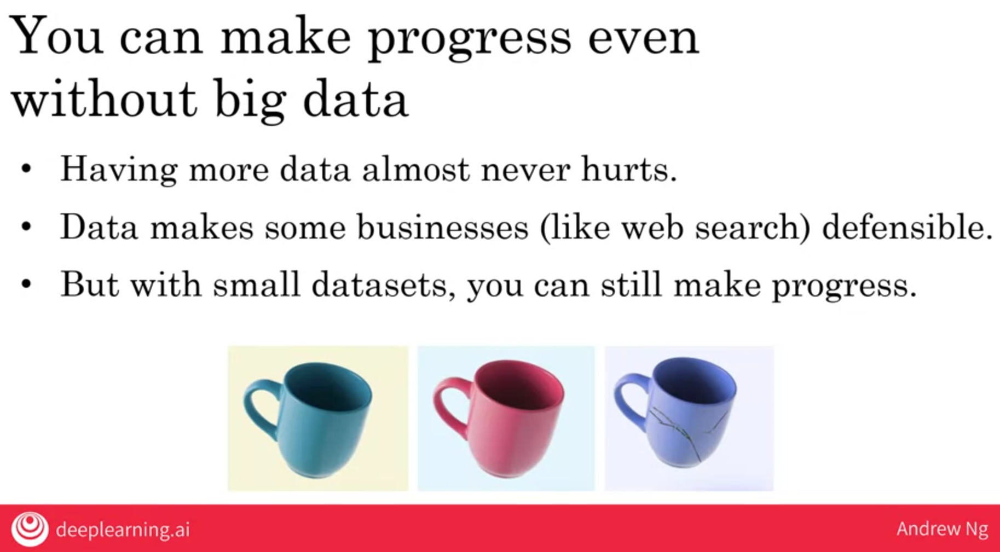

### Due diligence on Projects

Some AI project can take days and some may takes months. So before starting make sure the project is worth doing it for months.

1. Technical dilignece => To make sure project is feasible technically
2. Business diligence => To make sure project is feasible for the business
3. Ethical diligence => Making humaity/society good.

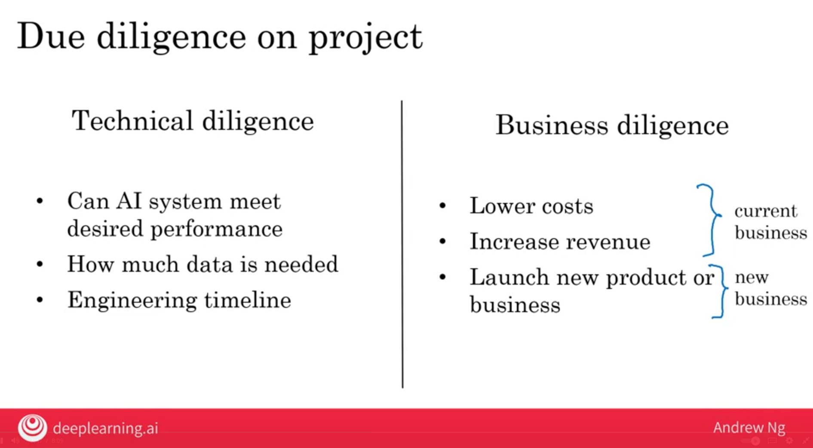

### Build vs Buy
Either to build a solution or buy ML solutions

If there is an industry standard or solution go for it rather then building your onw. In the digram there is a train analogy, in shorter sprint you may be ahead but train will catch you up.  

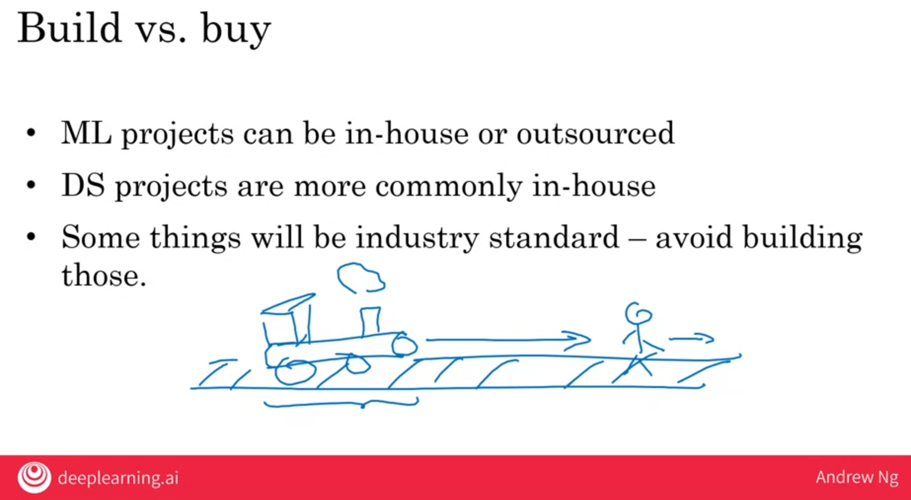

### Working with an AI team

How AI teams think about data and thinks about success

1. Specify your acceptance critera
    - Make sure your acceptance criteria think of wether it should be statistical way or like what percent of time it has to be an average or good.  
    - 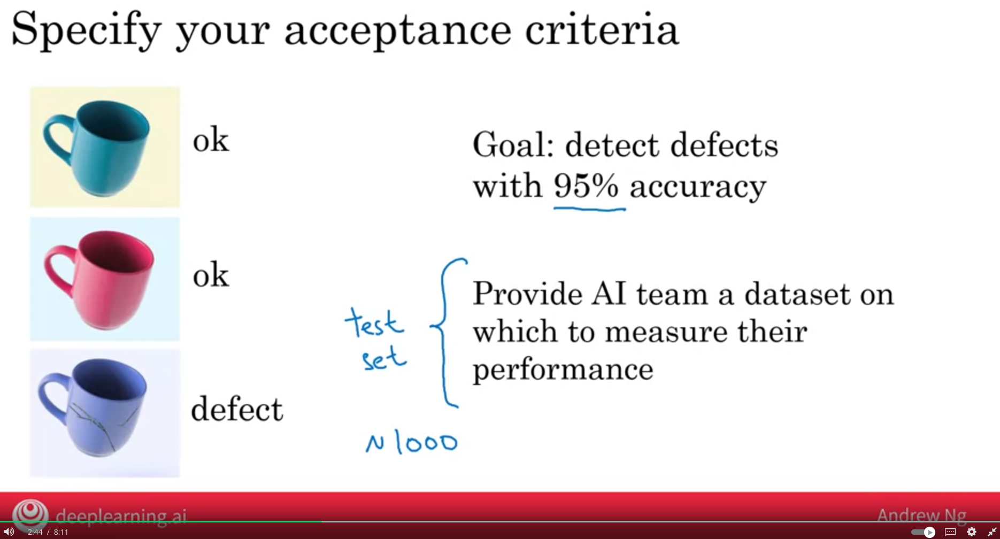 

2. Training set and Test set
    - 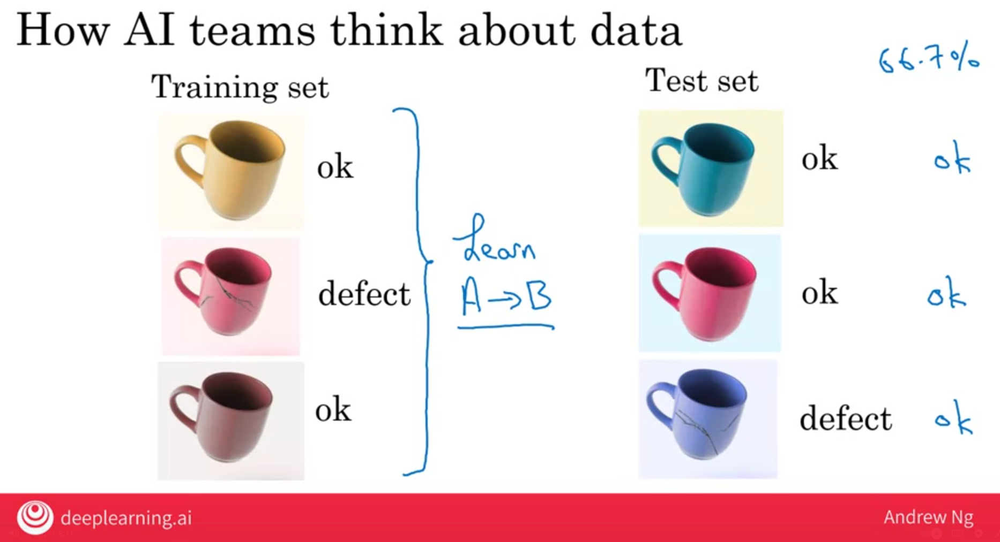

### Pitfall: Expecting 100% accuracy

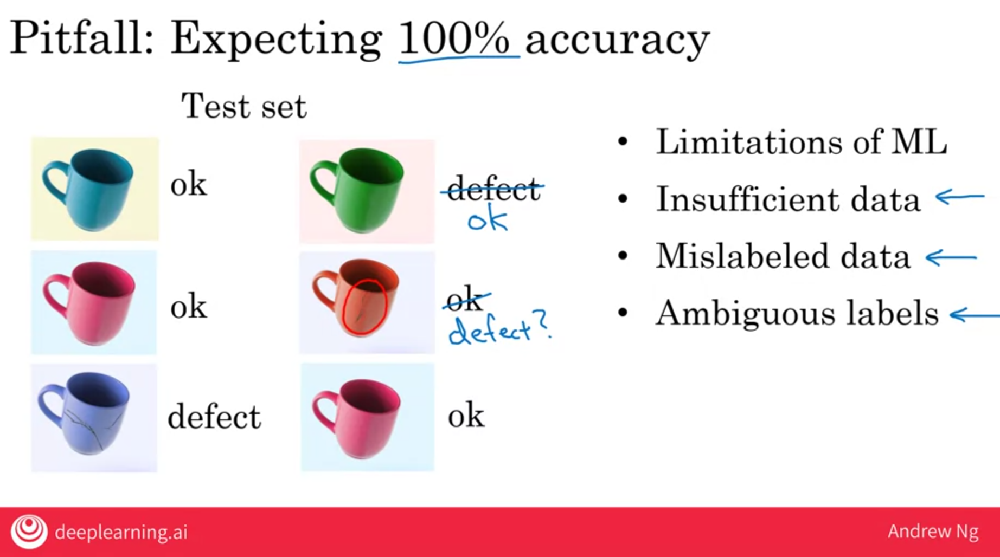

### AI technical tools

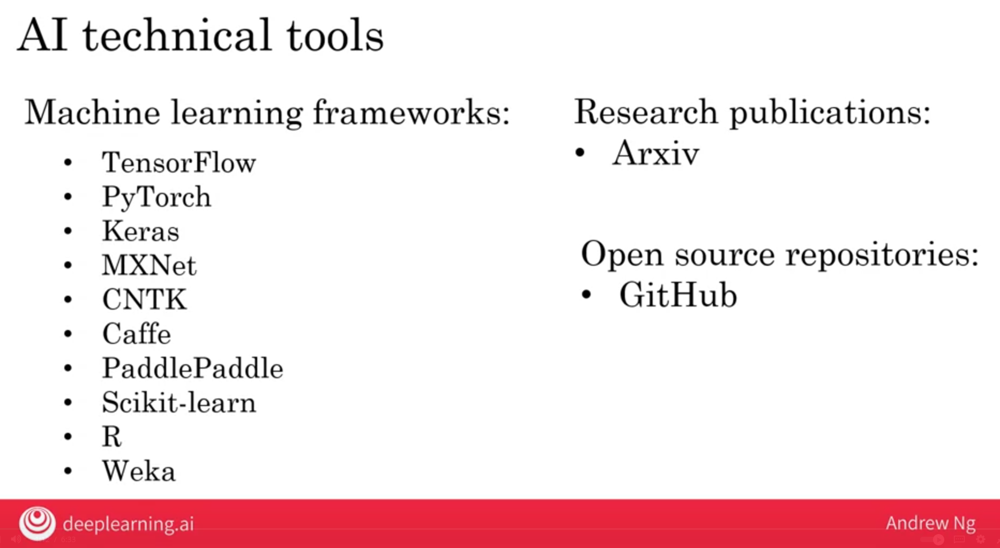
