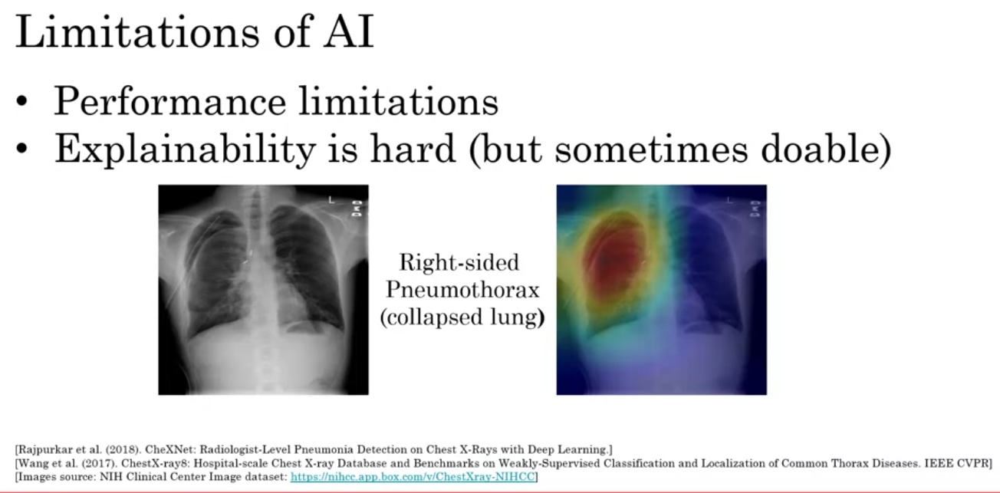
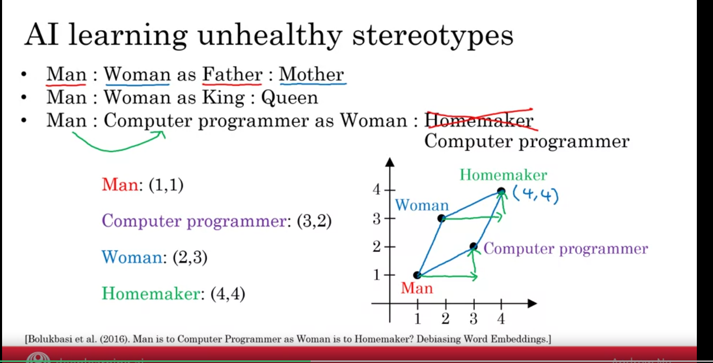
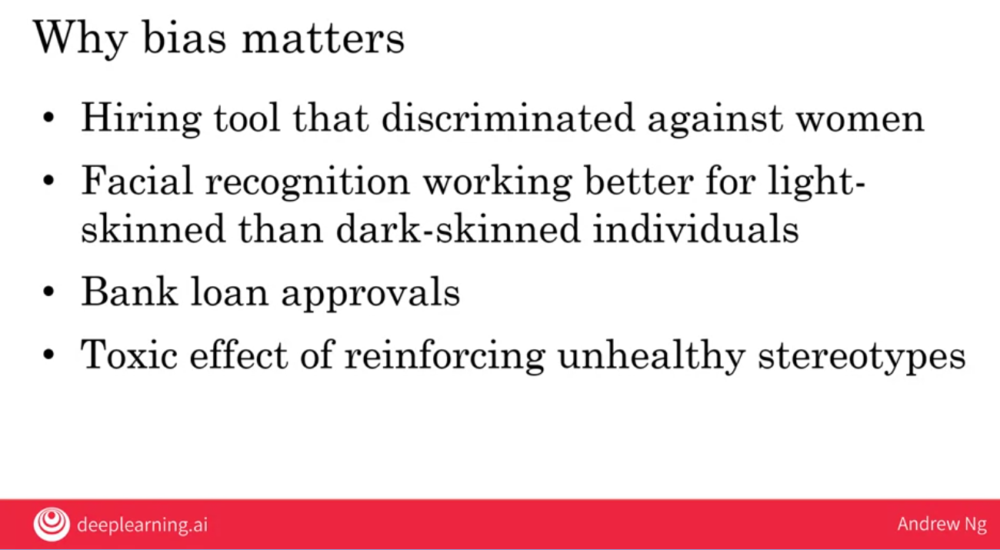
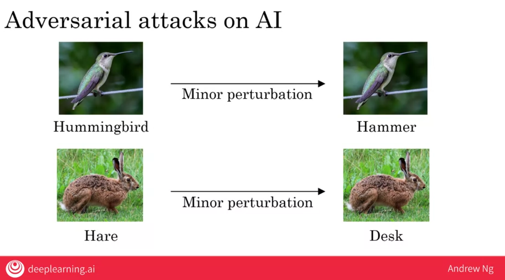
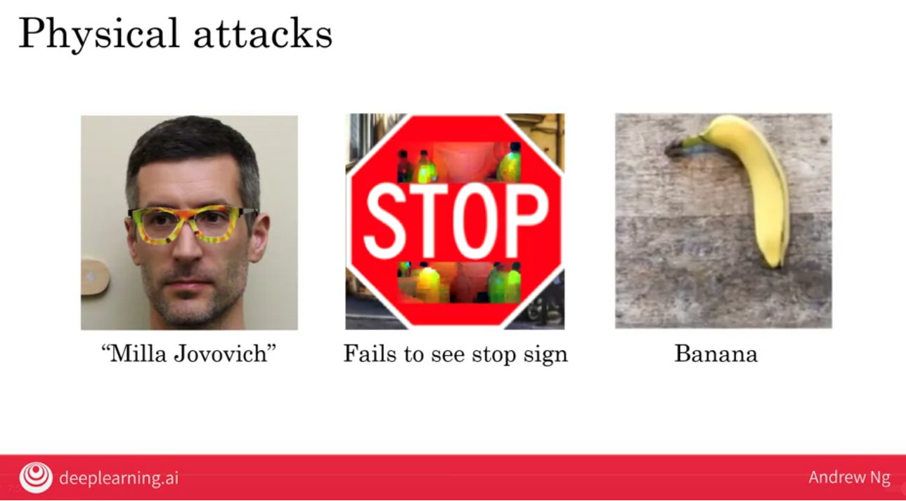
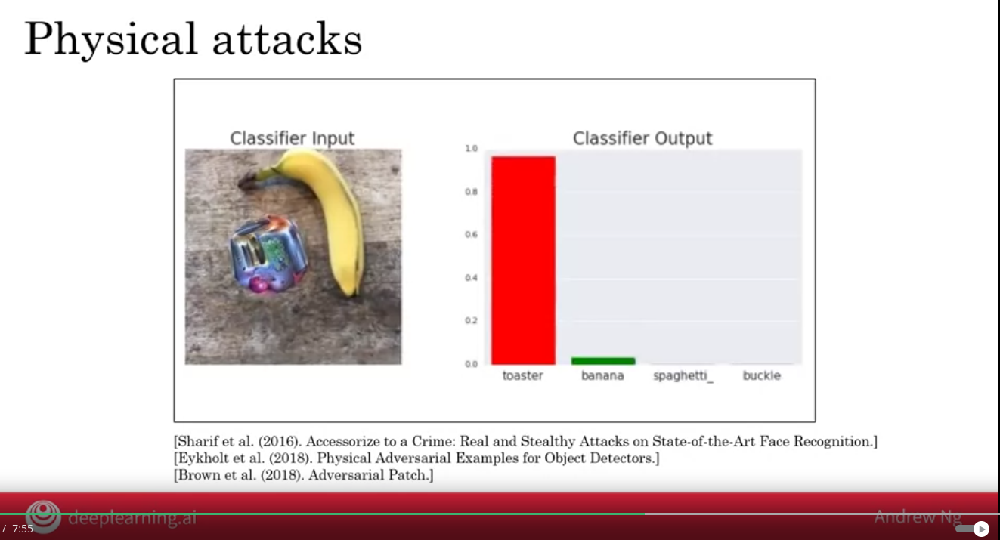
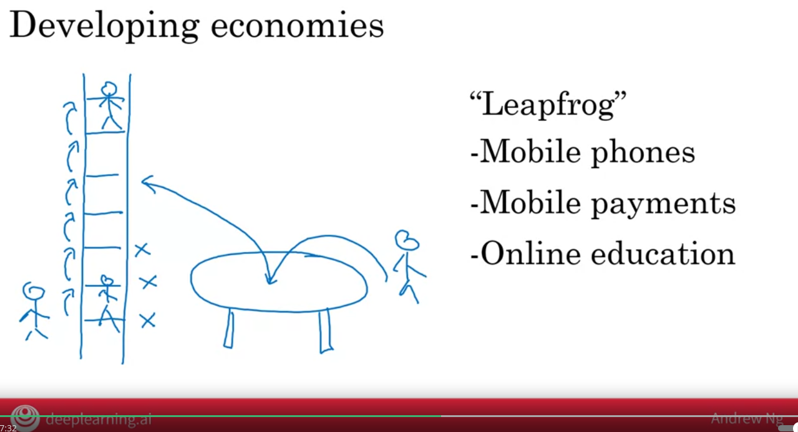
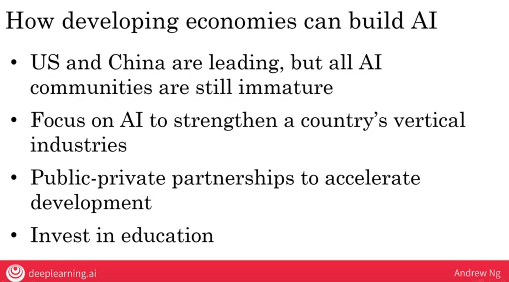
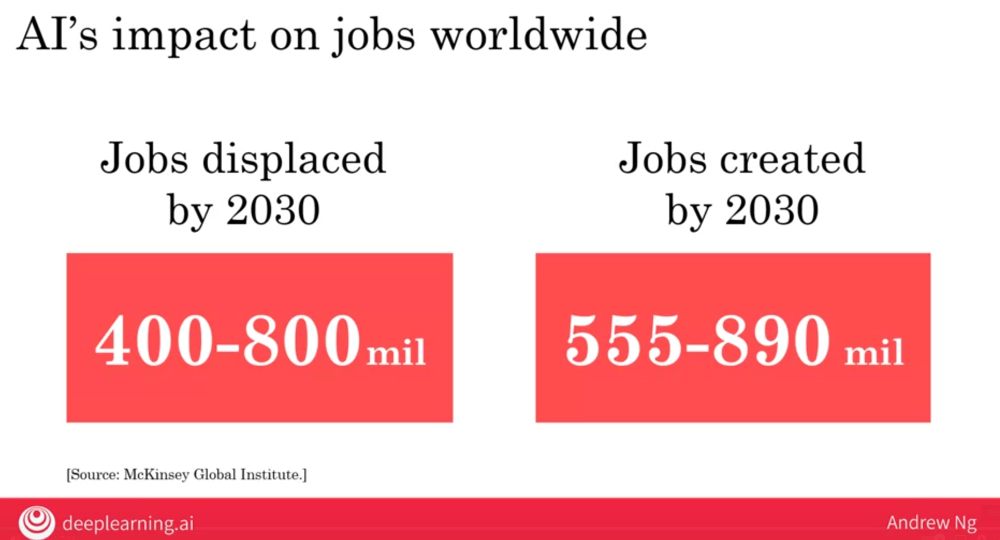
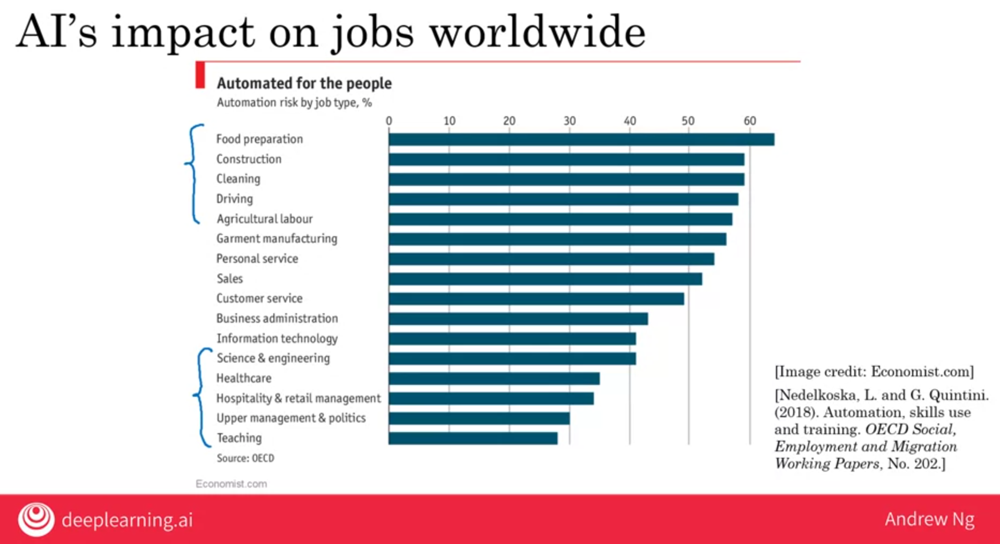

<h1 align="center">AI and society</h1>

### A realistic view of AI

Goldilocks rule for AI => We shouldn't be too optimistic or pessimistic what AI can do.

- Too optimistic: Sentient/ super-intelligent Killer robots coming soon.
- Too pessimistic: 
- Just right: AI can't do everything, but will transform industries

#### Limitations of AI
- Performance limitations
- Explainability is hard
    - How a conclusion is being made, like in X-ray the AI system use heat map to show its conclusion.
    - 
- Baised AI through baised data
    - If data given to train is not baised, then AI will be biased.

- Adversarial attacks on AI

### Discrimation / Bias

The AI uses numbers to map information

#### Combating bias
- Technical solutions
    - G.g **zero out** the bias in words
    - use less baised and/or more inclusive data
- Transparency and/or auditing processes
- Dverse workforce
    - creates less biased applications

### Adversarial attacks

Means make the sytem do other thing then what was inteded to do.

 
#### Physical Attack
An attack modifying as image before it upload or sent it to the system

### Adversarial defenses

- Defenses do exist, but incur some cost
- White hat hackers community.

### Adverse uses of AI

- DeepFakes
    - Synthesize video of people doing things they never did
- Undermining of democracry and privacy
    - Oppressive surveillance
- Generating fake comments
- Span vs anti-spam and fraud vs anti-fraud

### AI for developing Economies
 

### AI and jobs

### Conclusion

#### What we have learned

1. What is AI?
- AI technology
- Machine Learning
- Data Science
- Supervised Learning Input A->B
- What AI can do and can't

2. Building AI projects
- What it feels to build AI project
- Workflow of Machine Learning project
- Workflow of Data science project
- Carrying out Techincal and Business deligence

3. Building AI in your company
- How AI projects can fit in company
- Smart speakers and Self driving
- AI transformation playbook

4. AI and society
- Limitations of AI beyond Technical limitations
- How AI is effecting developing economies and job worldwide.
