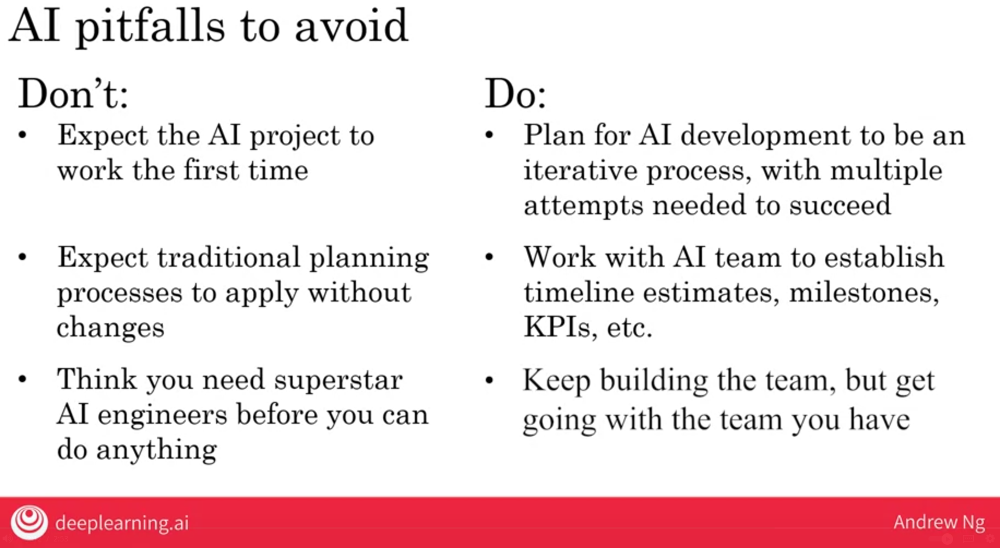

<h1 align="center">Building AI in your company</h1>

### Case study smart speaker
Lets take an example you want to build a smart speakers so how you do that?

1. Trigger word/wakeword deduction
    - `Hey siri` tell me a joke.
    - The trigger word is `Hey siri`
    - Input A is the audio msg and Ouput B is 1/0.
    - The speaker will remain always ready to listen the trigger word.

2. Speech recognition
    - The next thing is to convert the speech into text
    - The input A is `Audio: tell me a joke` the output B will be the text transcript.

3. Intent recognition
    - `tell me a joke`, the next step is to identify the intent. There are many ways to say the same thing. So during this AI process we need to identify the intent.

4. Execute command
    - The final step is the execute the software code to perform the identified intent. 

### Case study self driving cars

Lets take an example you want to build a self driving car so how you do that?

### Roles of an AI team

As the AI is moving fast so there are not very defined job titles and many companies have different titles as well.

1. Software Engineer
    - E.g joke exeuction, ensure self driving reliability. Possible 50/50 %

2. Machine Learning Engineer
    - Input A -> Output B

3. Machine Learning Researcher
    - Extent state-of-the-art in ML
    - publish research papers
     - ...

4. Applied ML Scientist
    - Lies between Machine Learning Engineer and Machine Learning Researcher

5. Data Scientist
    - Examine data and provide insights
    - Make presentation to team/executive

6. Data Engineer
    - Organize data
    - Make sure data is saved in an easily accessible, sure and cost effective way.

7. AI Product Manger
    - same as product manager but with the sense of what and what not can be done by AI with some other differences as well.

### Conculsion: It does not require a large team to start AI projects. 

### AI Transformation Playbook

1. Execute pilot projects to gain momentum
- More important for the inital projects to be successful rather than valuable 
- Pick something that have good chance of sucess then valueblae
- Show traction within 6-12 months

2. Build an AI in house team
- Initail funding should be injected by CEO to AI department. Not something AI team will need to get budget from Business units.
- 

3. Provide broad AI training
- 

4. Develop AI strategy
- **Start working on above steps and get better understanding of what AI can and cant't do is recommmended.** 
- Leverage AI to create an advantage specific to your idustry sector. 
- Virtuous Cycle of AI => Positive feedback loop
- 
- Consider creating a data strategy
    - strategic data acquisition => e.g offer free services to collect data
    - unified data warehouse
    - **winner take all** (defeseful business like facebook, uber etc) if you're in such business you can take over if you use AI as accelerartor
    - 

5. Develop internal and external communications
- 

### AI Pitfalls to avoid

### Computer Vision

#### Image classification/Object recognition
- Idenity what is in the image like cat
- Face recognition syste

#### Object detection
- Deduct object their types and its position

#### Image segementation
- Image segementation draws precise bounderies around the objects it founds

#### Tracking
- Computer vision is also used in videos to track objects

### National Language Processing
NLP refers to AI understnding natural language

#### Text classification
Classify a text into different categories e.g. Email => spam/not-spam
- Sentiment recognition => Food is good => find out what is the sentiment

#### Information retrieval
- E.g web search

#### Name entity recognition
- system to find all the people location etc from a text.

#### Mchine Translation

#### Others: parsing, part-of-speech tagging

### Speech

#### Speech recognition (speech to text)
#### Trigger word/wakeword recognition
#### Speaker ID
- who is speaking
#### Speech synthesis (text-to-speech (TTS))

### Robitics
- Perception => find out what's around you
- Motion planning => find path for the robot to follow
- Control => seding commands to the motors

## Unsupervised learning

Given data (witout any specific desired output lables), find something interesting about the data. 

## Transfer Learning

Learn from task A, and use knowledge to help out on task B. 

### Reinforcement learning

Use a **reward signal** to tell the AI when it is doing well or poorly. It automatically learns to maximize its rewards. 

### GANs (Generative Adversarial Network)

Synthesize 

### Knowledge Graph
