### What is generative AI?

An artificial intelligence system that can produce high quality content, specifically **text, images and audio**.

### How generative AI works?
Generative AI generates text using Large Language Models (LLMs)

LLMs are built using supervised learning.

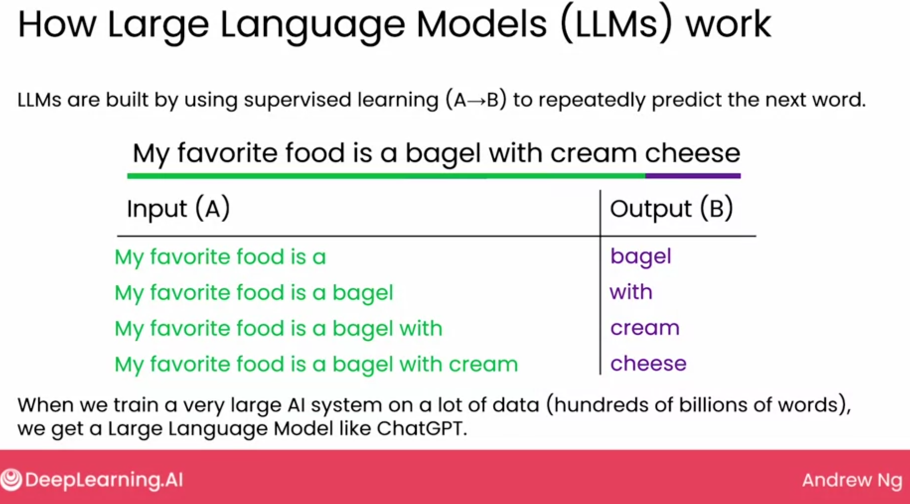

#### Exmples of tasks LLMs can carry out
LLMs can be used in web app or software applications. Like search can be a web app but reading email is a software based application integreted into a system. 

1. Writing
    - Given a prompt the LLMs can write pretty good.
2. Reading 
    - LLMS can also read like read customer emails and mark them as complaint or not
3. Chatting
    - LLMs can be useful for buillding chat bots.
    - 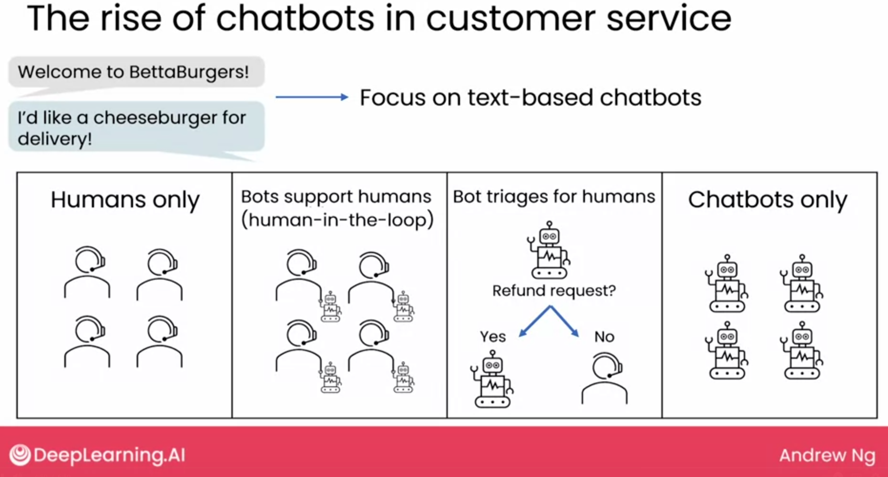
    - 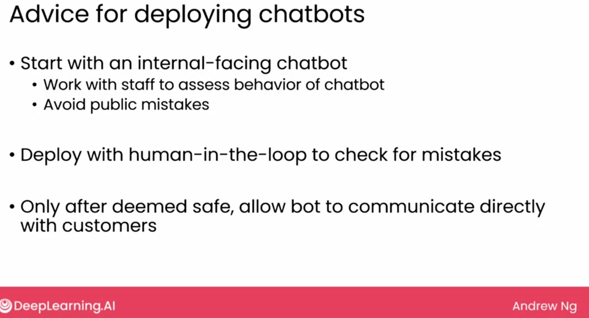

4. ...

#### Summary of tasks LLMs can carry out
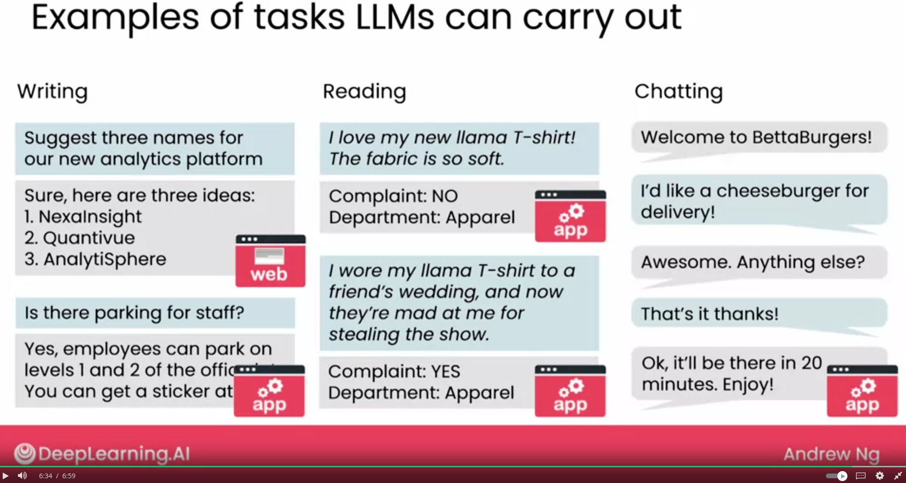

### Limitations of LLMs
- Knowledge cutoffs
- Hallucinations
- the input (prompt) (and output) length is limited
- Generative AI does not work well with structured (tabular) data.
- Bias and Toxicity
    - 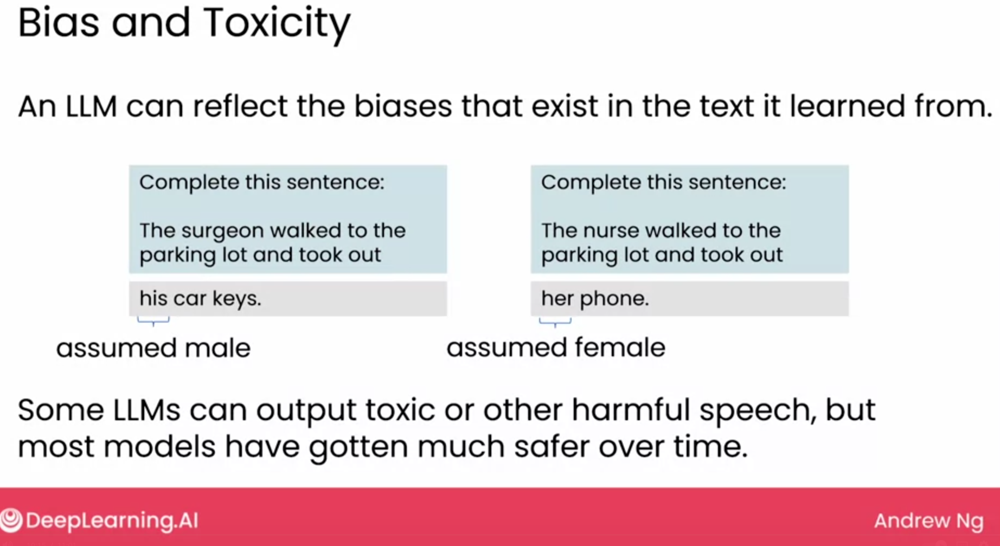

### Tips for promopting
- Be detailed and specific
    - Give sufficient context for LLM to complete the task
    - Describe the desired task in detail

- Guide the model to think through its answers
    - 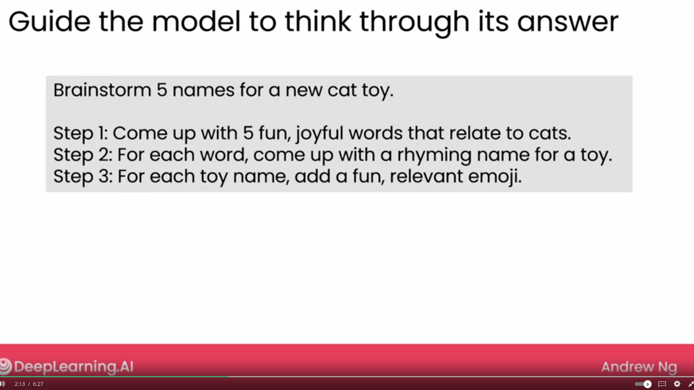
    - 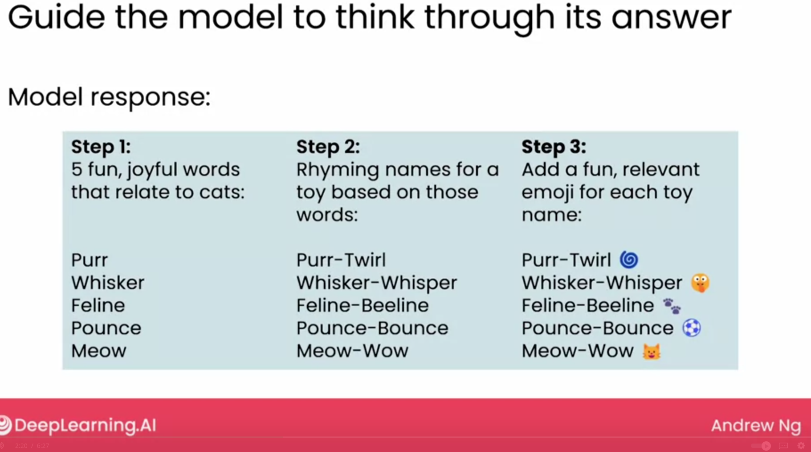

- Experiment and iterate
    - 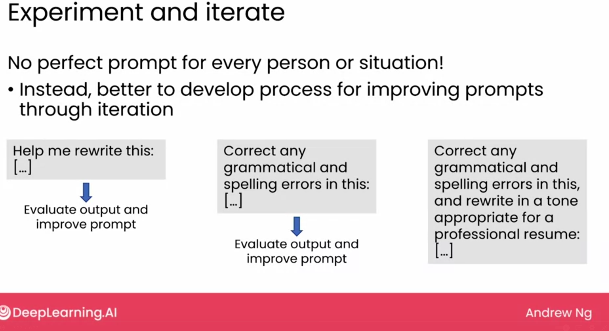

- Iteratively improving your prompt
    - 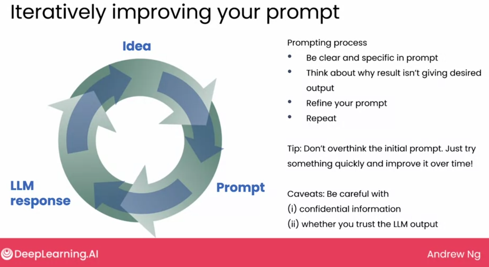

### Image generation
Image generation is mostly done using **diffusion model**

The hear of diffusion model is **supervised learning**

Diffusion models are learnt from huge number of images found on the internet. 

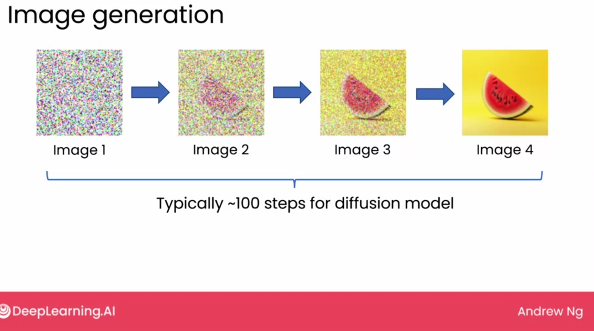

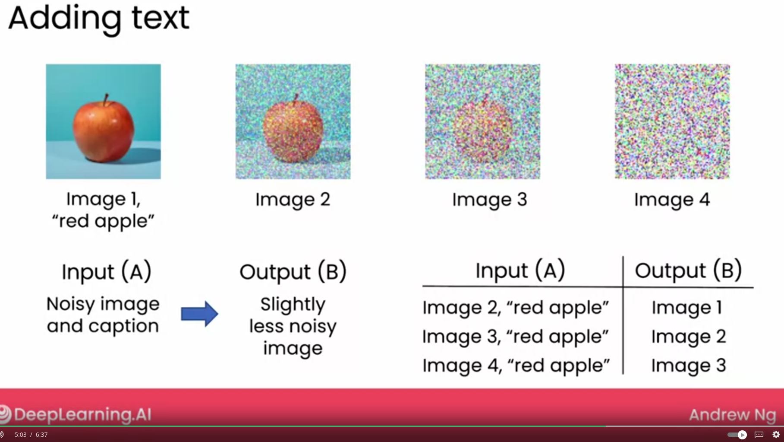

### Generative AI and the Economy

You can learn about the impact of generative AI on the economy by reading these reports and articles:

[McKinsey: The economic potential of generative AI: The next productivity frontier](https://www.mckinsey.com/capabilities/mckinsey-digital/our-insights/the-economic-potential-of-generative-ai-the-next-productivity-frontier#introduction), McKinsey Digital report, June 2023 

[GPTs are GPTs: An Early Look at the Labor Market Impact Potential of Large Language Models](https://arxiv.org/pdf/2303.10130.pdf) , Tyna Eloundou, Sam Manning, Pamela Miskin, and Daniel Rock, March 2023 (arXiv:2303.10130)

[Goldman Sachs: The Potentially Large Effects of Artificial Intelligence on Economic Growth](https://www.gspublishing.com/content/research/en/reports/2023/03/27/d64e052b-0f6e-45d7-967b-d7be35fabd16.html) , Joseph Briggs and Devesh Kodnani, March 2023