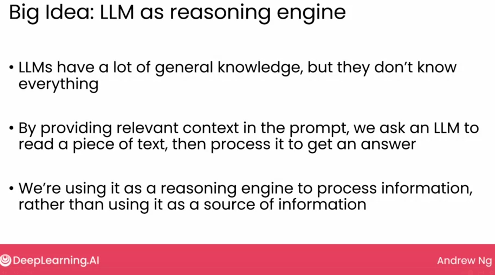

### Using generative AI in software applications

Before Generative AI, it took months to even make a simple application like restaurant reviews sentiment analysis. Now it takes only hours. 

### Lifecylcle of generative AI project

Building Generative Ai is highly eampirical process. We repeatedly find and fix mistakes.

1. Scope project
    - E.g you want to build a restaurant reviews sentiment analysis system
2. Build/improve system
    - 
3. Internal evaluation
    - Deploy the system internally, test it and build/improve until it meets the desired output
4. Deplpy and monitor
    - Once deployed for users still monitor it, build and improve the sytem to sure it is working as expected

### Retrieval Argument Generation (RAG)

RAG gives LLM additional information. 

Retrieve required information from the knowledge base and augmunt into the prompt. 

#### LLM as reasoning engine with use of RAG

### Fine Tuning
Gives you another technique in addition than RAG to help improve the capabilites to improve the capabilites of an LLM.

#### Why Fine-tune

1. To carry out a task that isn't easy to define in a prompt.

2. To help LLM gain specific kenowledge.
    - Reading medical notes
    - Reading Legal or financial documents

3. To get a smaller model to perform a task.
    - Lower cost/latency to deploy
    - can run on mobile/laptop (edge devices)

### Pre training
This is so-expesive and only done by high tech companies.

### Chosing a model

These are general guidelines

#### Model size

One way to look at how capabale a model is to look at the model size. 

#### Closed or open source

### Instructions tuning
When we give a prompt to an LLM it doesn't only predit the next word but it actually follows your instructions. 

Instructions tuning which is basically to take a pre-tained LLM and fine tune it on examples of good answers to questions or good examples of the LLM following your instructions.

### Reinforcement learning from human feedback (RLHF)

We want LLMs answers to **Helpful, Honest, Harmless (HHH):-)
**

A technique to generate responses that are more aligned like human responses.

Train an **answer quality model** (to rate the answers of the model), given a prompt => generate answers and then human label them a score to rate the response. 

We can then train using supervised model Input A and Input B to tuned the LLM to get higher score.

### Agents

Use LLM to choose and carry out complex sequence of actions. 