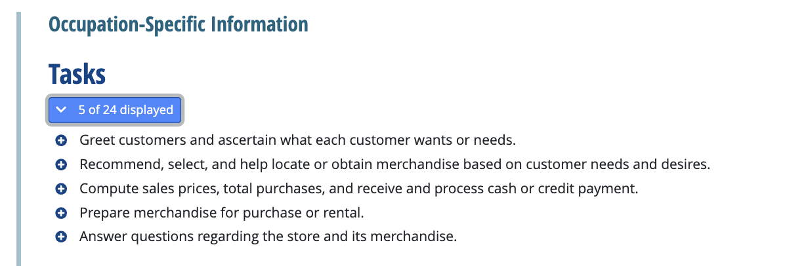

1. **Question 1**

   Which of these job roles are unlikely to find any use for web UI LLMs?
   1 point

   - [ ] Marketer
   - [ ] Recruiter
   - [ ] Programmer
   - [x] None of the above

2. **Question 2**

   What is the relation between AI, tasks, and jobs?
   1 point

   - [x] Jobs are comprised of many tasks. AI automates tasks, rather than jobs.
   - [ ] Tasks are comprised of many jobs. AI automates tasks, rather than jobs.
   - [ ] Jobs are comprised of many tasks. AI automates jobs, rather than tasks.
   - [ ] Tasks are comprised of many jobs. AI automates jobs, rather than tasks.

3. **Question 3**

   Here are some of the tasks of a retail salesperson from O*NET. (We encourage you to check out the page yourself.) Say we decide to use AI to augment (rather than automate) a salesperson's task of recommending merchandise to customers. Which of the following would be an example of this?
   1 point

   

   - [ ] Build a chatbot that automatically recommends products that customers can access directly, with no salesperson involved.
   - [ ] Build an AI chatbot that can role-play being a customer to help the salesperson practice having conversations with customers.
   - [x] Build an AI system to suggest products to the salesperson, who then decides what to recommend to the customer.
   - [ ] This has no business value and should not be done.

4. **Question 4**

   When looking for augmentation or automation opportunities, what are the two primary criteria by which to evaluate tasks for generative AI potential? (Check the two that apply.)
   1 point

   - [ ] Whether the task is the iconic, defining task for a job role.
   - [x] Technical feasibility (can AI do it?).
   - [x] Business value (how valuable is it to automate?).
   - [ ] Whether to use prompting, RAG or fine-tuning.

5. **Question 5**

   What is a quick way to start experimenting with an LLM application development project?
   1 point

   - [ ] Recruiting a large team of data engineers to organize your data.
   - [ ] Hiring a dedicated prompt engineer.
   - [ ] Forming a large team with specialized roles.
   - [x] Try experimenting and prototyping with a web-based LLM to assess feasibility.
