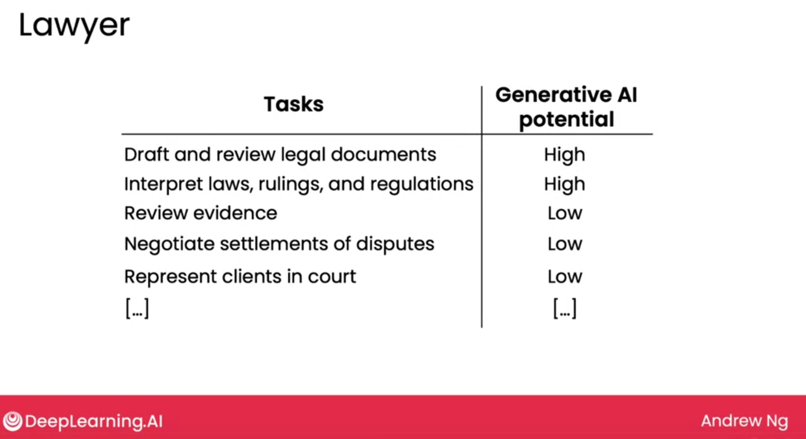
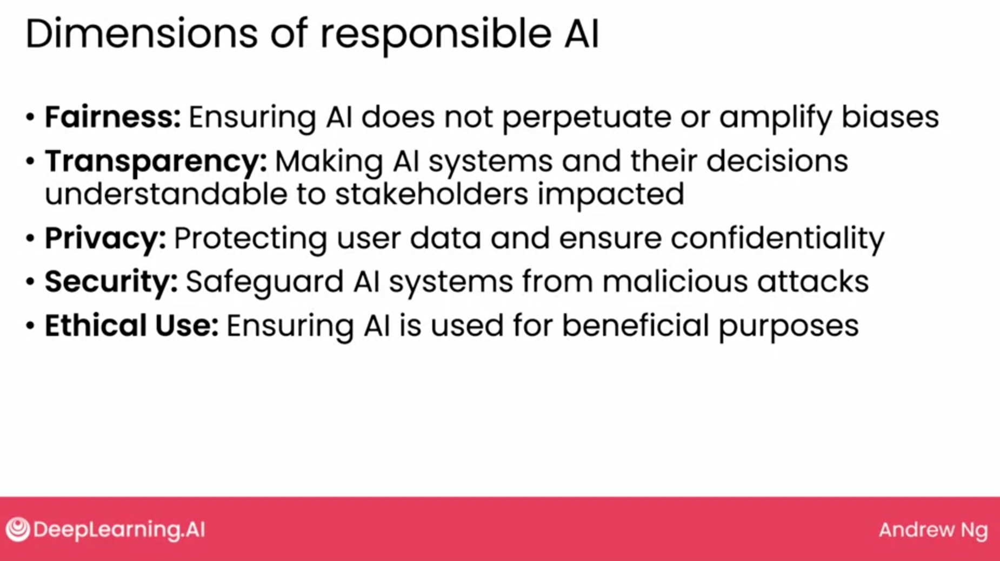

## Generative AI in business

Marketer => Brainstrom email ides
Recuirter => Summerize resumes
Programmer => Generate code

#### Idenitifying automation opportunites

AI doesn't automate jobs, it automates tasks.

#### Augmentation vs Automation

Augmentataion   =>  Helps humans a task
Automation  =>  Automatically perform a task

#### Evaluating AI potential

The potential for augmentation/automating a task, depends on. 

1. Technical Feasibility
    - Can AI do it or not ?
        - You can think of `Can a fresh graduate following the instructions in a prompt complete this task`. If Yes then there are high chances this task can be done through AI. 

    - What is the cost ?

2. Business Value
    - How valuable is it for AI to augment or automate this task.

#### **there are web apps that can break the tasks of a job [onetonline](onetonline.org)**

### Additional job analysis examples

### New workflows and new opportunities
Rather then thinking of automating a process to decrease the time 10% think of a new organization that enables 10% improvement in processes.  

In this example we can see generative AI can definately help in launching website. A new work flow can be created using AI to quickly launch multiple version of websites and then analyze the campaign and improve. 

### Analyzing customer tasks

You can also think of augment/automate the tasks of your customers as well rather then just thinking about employees tasks to be automate/augment.

### Teams to build generative AI solutions.

1. Software Engineer
2. Machine learning engineer
3. Product manager
4. Prompt Engineer => Hyped job, not real, they do ML
5. Extra Roles
    1. Data Engineer
    2. Data Scientist
    3. Project Manger
    4. Machine learning researcher
    

### Automation potential across sectors

Generative AI will impact higer paid jobs more.

Supervised learning impacted the lower wage jobs.

Generative AI or LLM are impacting higher wage jobs.

**Generative AI could have the most impact on knowledge workers meaning workers who generates value primarily through their knowledge, including their expertise, their critical thinking, and their interpersonal skills.** 

## Generative AI in society

1. LLM Biasness
    - Solution: Fine-tunning, RLHF etc

#### Harm caused by AI

### Artificial General Intelligence (AGI)

AI that can do any intellectual task that a human can. 

### Responsible AI

- There is no mathematical defination for ethical. 
- Build a culture that encourges discussions and debate on ethical issues.
- Brainstrom how things can go wrong.
- Work with a diverse team and include prespective from all sides.

