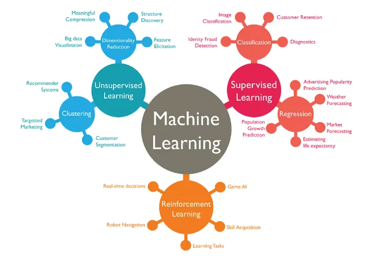
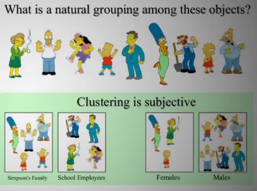
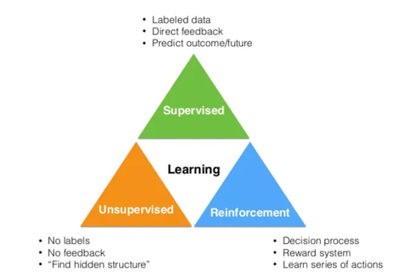

https://medium.com/@randylaosat/a-beginners-guide-to-machine-learning-dfadc19f6caf

# Machines can predict the future, as long as the future doesn’t look too different from the past.

### “More data beats better models. Better data beats more data.” — Riley Newman => A simple modal trained on large data set can surpass a sophisticated modal trained on small data set. A small data set representing your problem will outperform a model trained on large generic data set

### looking back to look forward. => If the old data looks a lot like the new data, then the things you can say about the old data will probably be relevant to the new data

### There are three main categories of machine learning:

### Supervised Learning => The machine learn from labeled data.
 - Easier to train machines on labeled data.
 - **Regression problem**
    - to predict continious values like trying to predict cost of a house or a weather outside in degrees. This type of problem doesn't have specific value constraints becuase the value could be any number.
 - **Classification problem**
    - When trying to classify an asnwer (Am I smart?) into two specifc categories yes or no. This is also called binary classification problem. 

#### [Example of data set](https://developers.google.com/machine-learning/glossary/#example)

| Features | | | | | | | | | | | Label |
|-|-|-|-|-|-|-|-|-|-|-|-|

| Temperature | Humidity | Pressure | Test score |
|-|-|-|-|
| 15 | 47 | 998 | Good |
| 19 | 34 | 1020 | Excellent |  
| 18 | 92 | 1012 | Poor |

### Unsupervised Learning => The machine learns from un-labeled data. Means there is no right answer given to the machine to learn, but the machine hopefully find patterns form the data to come up with an answer.
- Since there is no labeled data for machines to learn from, the goal of the unsupervised learning is to **detect patterns** in the data and to group them. 
- **Clustering Problem**
    - looking for similarities in the data, if there is a comman cluster or group the algorithm with group them and categorize them. Like grouping customers on their past buying behaviour. 
- **Association Problem**
    - rules and meaning behing differenet groups, finding a relationship between customer purchases. Like a customer buy bread and pampers. The store deduced from this statement that males who went to buy bread also buy pampers as well. 

#### [Example of data set](https://developers.google.com/machine-learning/glossary/#example)

| Features |
|-|

| Temperature | Humidity | Pressure |
|-|-|-|
| 15 | 47 | 998 |
| 19 | 34 | 1020 |  
| 18 | 92 | 1012 |

### Reinforcement Learning => The machine learns through a reward-based system.

- This type of machine learning requires a use of **Reward/Penalty system**
- Reinforcement Machine learning is a subset of Aritficial Intelligence. With the wide range of possible answers from the data, reinforced learning is an iterative step. It continiously learn.
- Examples: 
    - Training a machine to learn how to play (Chess, Go)
    - Training a machine how to learn and play Super Mario by itself
    - Self-driving cars

# Summary

